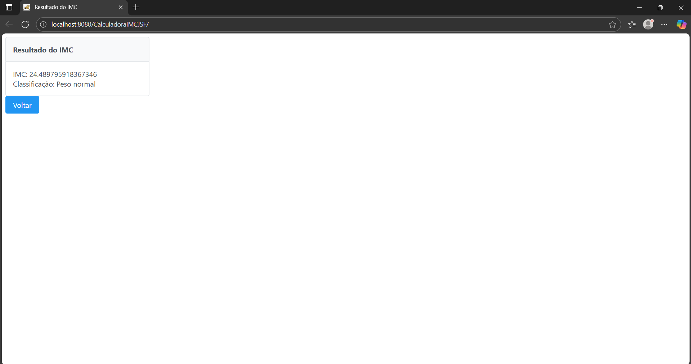

# 📘 Projeto JSF com PrimeFaces – Cálculo de IMC  

## 📖 Introdução  
De forma introdutória, este projeto foi desenvolvido como parte da disciplina **Programação de Servidores WEB**, ministrada pelo professor **Mestre Gustavo Maruyama**, no curso superior de **Tecnologia em Sistemas para Internet (TSI)** do **Instituto Federal de Educação, Ciência e Tecnologia de Mato Grosso do Sul – Câmpus Coxim**.  

O objetivo é demonstrar a utilização da biblioteca **PrimeFaces** em conjunto com o **JSF (Jakarta Server Faces)**, criando uma aplicação para cálculo do **Índice de Massa Corporal (IMC)** com interface gráfica mais moderna e responsiva.  

---

## ⚙️ Tecnologias Utilizadas  
- Java  
- JSF (Jakarta Server Faces)  
- PrimeFaces  
- Payara Server  
- XHTML  

---

## 🚀 Funcionalidades  
- Inserção de **peso** e **altura**  
- Cálculo automático do **IMC**  
- Exibição do resultado na mesma página utilizando **AJAX nativo do PrimeFaces**  

---

## 🖼️ Demonstração  

### Formulário de Cálculo  
  

### Resultado do IMC  
  

*(As imagens devem ser colocadas dentro de uma pasta chamada `images` no repositório.)*  

---

## 🧩 Exemplo de Código  

```xhtml
<h:form>
    <p:panel header="Cálculo de IMC">
        <p:panelGrid columns="2" cellpadding="5">
            <h:outputLabel for="peso" value="Peso (kg):" />
            <p:inputNumber id="peso" value="#{imcBean.peso}" minValue="0" decimalPlaces="2" />

            <h:outputLabel for="altura" value="Altura (m):" />
            <p:inputNumber id="altura" value="#{imcBean.altura}" minValue="0" decimalPlaces="2" />

            <p:commandButton value="Calcular IMC" action="#{imcBean.calcular}" update="resultado" />
        </p:panelGrid>
    </p:panel>

    <h:panelGroup id="resultado" rendered="#{not empty imcBean.resultado}">
        <h:outputText value="Resultado: #{imcBean.resultado}" />
    </h:panelGroup>
</h:form>
```

---

## 📌 Conclusão  
Com a implementação deste projeto foi possível compreender melhor a integração do **PrimeFaces** com o **JSF**, explorando suas vantagens em relação à construção de interfaces modernas, responsivas e interativas. Além de reforçar os conceitos de **servidores web em Java**, a atividade demonstrou como bibliotecas de componentes podem agilizar o desenvolvimento e melhorar a experiência do usuário.  

---

## 👨‍💻 Autor  
**Maicon Cezar**  
Aluno do curso de Tecnologia em Sistemas para Internet (TSI) – IFMS Coxim  
